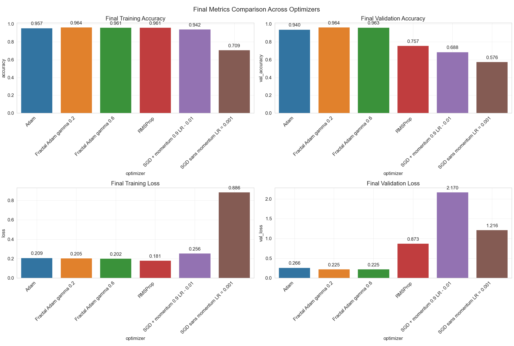

# 🌀 FractalMomentAdam Optimizer

**FractalMomentAdam** is a modification of the classic **Adam** optimizer that introduces **fractal (multi-scale) moment smoothing**.  
The idea is inspired by the **self-similarity of fractals**, where adaptive moments are estimated simultaneously at **fast** and **slow** scales, providing a better balance between convergence stability and learning speed.

**The algorithm was developed for highly noisy and imbalanced datasets, where standard optimizers may demonstrate unsatisfactory accuracy or unstable training behavior.**

---

## 🚀 Core Idea

In standard Adam, the first- and second-order moments are exponentially smoothed using a single scale (`beta1`, `beta2`):

m_t = β₁ * m_{t-1} + (1 - β₁) * g_t 

v_t = β₂ * v_{t-1} + (1 - β₂) * g_t²

In **FractalMomentAdam**, we introduce **two-scale (fractal) smoothing**:

- **Fast moments** (`m_fast`, `v_fast`) — capture short-term dynamics.  
- **Slow moments** (`m_slow`, `v_slow`) — accumulate long-term trends.

Both scales are then **merged via the fractal mixing coefficient γ (gamma)**:

m_eff = γ * m_fast + (1 - γ) * m_slow

v_eff = γ * v_fast + (1 - γ) * v_slow


This allows the optimizer to account for **local volatility** and **global learning direction** simultaneously — similar to how fractal structures combine micro- and macro-level patterns.

---

## ⚙️ Parameters

| Parameter | Type | Default | Description                                                                                                                                                                                                  |
|------------|------|----------|--------------------------------------------------------------------------------------------------------------------------------------------------------------------------------------------------------------|
| `learning_rate` | float | `1e-3` | Learning rate.                                                                                                                                                                                               |
| `beta_1` | float | `0.9` | Smoothing factor for fast moments (1st order).                                                                                                                                                               |
| `beta_2` | float | `0.999` | Smoothing factor for fast moments (2nd order).                                                                                                                                                               |
| `beta_1_slow` | float | `0.99` | Smoothing factor for slow moments (1st order).                                                                                                                                                               |
| `beta_2_slow` | float | `0.9999` | Smoothing factor for slow moments (2nd order).                                                                                                                                                               |
| `gamma` | float | `0.3` | **Fractal mixing coefficient** between fast and slow scales.<br>• `γ → 1` — fast scale dominates (reactive learning)<br>• `γ → 0` — slow scale dominates (stable learning)<br>• Recommended range: `0.3–0.7` |
| `epsilon` | float | `1e-7` | Small constant for numerical stability.                                                                                                                                                                      |

---

##  Usage with Keras / TensorFlow (Tested on Tensorflow 2.19.0 / Keras 3.10.0)

```python
from .FractalAdam import FractalMomentAdam

optimizer = FractalMomentAdam(
    learning_rate=1e-3,
    beta_1=0.9,
    beta_1_slow=0.995,
    gamma=0.3
)
```
##  Training Results

Training results on a simple CNN using the **PathMNIST** dataset from **MedMNIST**,  
compared with optimizers **Adam**, **SGD**, and **RMSProp**.



---
## MIT License